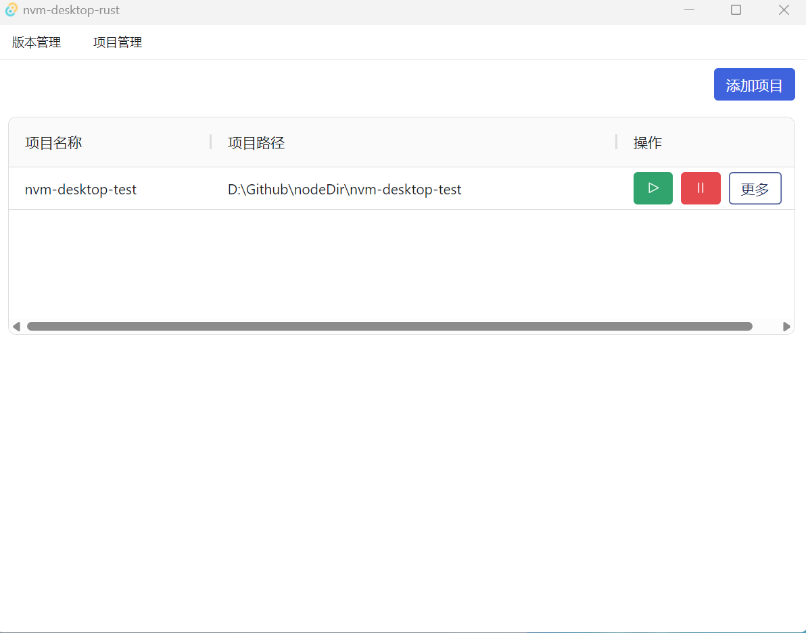

 # NVM-NODE-PROJECT-MANAGER

This is a Node project development management tool that allows you to quickly start projects during development and switch between projects with ease. It also provides node version management functionality similar to Nvm, enabling you to quickly switch between node versions for different projects.

## Installation
Simply find a file and click on the exe file after building. Create a new folder, place the exe file inside, and then add the folder to your environment variables.

```
set NVM_HOME=C:\Users\Administrator\Desktop\NVM-NODE-PROJECT-MANAGER
set NODE_HOME=C:\Users\Administrator\Desktop\NVM-NODE-PROJECT-MANAGER\versions\default
set PATH=%NODE_HOME%;%PATH%
```

Then, double-click the exe file to run it.

## Project Management
### Create a Project

Click the 'Create Project' button on the main interface, then enter the project name and

### Start a Project
Click the 'Start Project' button on the main interface, then select the project you want to start.


You also have the ability to quickly open VSCode and the terminal.

All dev logs during the development process will be saved in a log file.

# NVM-NODE-PROJECT-MANAGER

这是一个Node项目开发管理工具，它可以让你开发的时候快速启动项目，并且可以快速切换项目。同时它还提供了类似Nvm的node版本管理功能，让你可以在不同的项目之间快速切换node版本。

## 安装
随便找个文件加点击build后的exe文件即可。新建一个文件夹将exe文件放进去，然后将文件夹添加到环境变量中。

```
set NVM_HOME=C:\Users\Administrator\Desktop\NVM-NODE-PROJECT-MANAGER
set NODE_HOME=C:\Users\Administrator\Desktop\NVM-NODE-PROJECT-MANAGER\versions\default
set PATH=%NODE_HOME%;%PATH%
```

然后双击运行exe文件即可。

## 项目管理
### 创建项目

在主界面点击创建项目按钮，然后输入项目名称和
### 启动项目
在主界面点击启动项目按钮，然后选择要启动的项目。


同时你拥有可以快速打开vscode和终端的能力。

开发过程中的所有dev日志都会保留在日志文件中。

